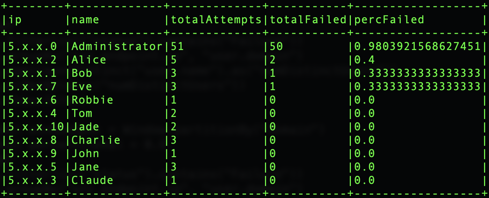

# Spark Use Cases

### Read in Authentication event class parquet data to detect users with a high rate of login failures.
###### ***This could indicative of brute force login attempts.***
```
import org.apache.spark.sql.types.DoubleType
import org.apache.spark.sql.expressions.Window

val df = spark.read.parquet("highFailedLogin.parquet")

val windowSpec = Window.partitionBy("user.domain")
val percentileVal = 0.9

val highLoginFailures = df
    .withColumn("failedBool", when(col("status").contains("Failure"), lit(1)).otherwise(0))
    .groupBy("src_endpoint.ip", "user.name", "user.domain")
    .agg(count(col("*")).as("totalAttempts"), sum(col("failedBool")).as("totalFailed"))
    .withColumn("percFailed", col("totalFailed") / col("totalAttempts").cast(DoubleType))
    .orderBy(desc("percFailed"))
    .withColumn("percThresh", percentile_approx(col("percFailed"), lit(percentileVal), lit(10000)).over(windowSpec))
    .filter(col("percFailed") > col("percThresh"))
```

The original aggregated dataframe prior to filtering and percentile aggregation:


The resulting dataframe after filtering users with login failure rate greater than the 90th percentile:


### Read in Authentication event class parquet data to detect ips failing to log into a high rate of distinct users names. 
###### This could be indicative of password spray.
```
import org.apache.spark.sql.expressions.Window

val df = spark.read.parquet("pwSpray.parquet")

val windowSpec = Window.partitionBy("`user.domain`")
val percentileVal = 0.9

val passwordSprayDf = df
    .filter(col("status").contains("Failure"))
    .groupBy("src_endpoint.ip", "user.domain")
    .agg(countDistinct("user.name").as("numDistinctUsers"))
    .withColumn("highPerc", percentile_approx(col("numDistinctUsers"), lit(percentileVal), lit(10000)).over(windowSpec))
    .filter(col("numDistinctUsers") > col("highPerc"))
```

The original aggregated dataframe prior to filtering and percentile aggregation:


The resulting dataframe after filtering ips with distinct user login failures that were greater than 90th percentile:


Example schema for authentication event class:
```|-- activity_id: long (nullable = true)
 |-- actor: struct (nullable = true)
 |    |-- process: struct (nullable = true)
 |    |    |-- file: struct (nullable = true)
 |    |    |    |-- name: string (nullable = true)
 |    |    |    |-- parent_folder: string (nullable = true)
 |    |    |    |-- path: string (nullable = true)
 |    |    |    |-- type_id: long (nullable = true)
 |    |    |-- pid: long (nullable = true)
 |    |-- user: struct (nullable = true)
 |    |    |-- account_type: string (nullable = true)
 |    |    |-- account_type_id: long (nullable = true)
 |    |    |-- domain: string (nullable = true)
 |    |    |-- name: string (nullable = true)
 |    |    |-- session_uid: string (nullable = true)
 |    |    |-- uid: string (nullable = true)
 |-- auth_protocol: string (nullable = true)
 |-- auth_protocol_id: long (nullable = true)
 |-- category_uid: long (nullable = true)
 |-- class_uid: long (nullable = true)
 |-- device: struct (nullable = true)
 |    |-- name: string (nullable = true)
 |    |-- os: struct (nullable = true)
 |    |    |-- name: string (nullable = true)
 |    |    |-- type_id: long (nullable = true)
 |    |-- type_id: long (nullable = true)
 |-- dst_endpoint: struct (nullable = true)
 |    |-- hostname: string (nullable = true)
 |-- logon_process: struct (nullable = true)
 |    |-- name: string (nullable = true)
 |    |-- pid: long (nullable = true)
 |-- logon_type_id: long (nullable = true)
 |-- message: string (nullable = true)
 |-- metadata: struct (nullable = true)
 |    |-- original_time: string (nullable = true)
 |    |-- product: struct (nullable = true)
 |    |    |-- feature: struct (nullable = true)
 |    |    |    |-- name: string (nullable = true)
 |    |    |-- name: string (nullable = true)
 |    |    |-- vendor_name: string (nullable = true)
 |    |-- profiles: array (nullable = true)
 |    |    |-- element: string (containsNull = true)
 |    |-- uid: string (nullable = true)
 |    |-- version: string (nullable = true)
 |-- severity_id: long (nullable = true)
 |-- src_endpoint: struct (nullable = true)
 |    |-- ip: string (nullable = true)
 |    |-- name: string (nullable = true)
 |    |-- port: long (nullable = true)
 |-- status: string (nullable = true)
 |-- status_code: string (nullable = true)
 |-- status_detail: string (nullable = true)
 |-- status_id: long (nullable = true)
 |-- time: long (nullable = true)
 |-- unmapped: struct (nullable = true)
 |    |-- Detailed Authentication Information: struct (nullable = true)
 |    |    |-- Key Length: string (nullable = true)
 |    |    |-- Package Name (NTLM only): string (nullable = true)
 |    |    |-- Transited Services: string (nullable = true)
 |    |-- EventCode: string (nullable = true)
 |    |-- EventType: string (nullable = true)
 |    |-- Impersonation Level: string (nullable = true)
 |    |-- Logon Information: struct (nullable = true)
 |    |    |-- Elevated Token: string (nullable = true)
 |    |    |-- Restricted Admin Mode: string (nullable = true)
 |    |    |-- Virtual Account: string (nullable = true)
 |    |-- New Logon: struct (nullable = true)
 |    |    |-- Linked Logon ID: string (nullable = true)
 |    |    |-- Network Account Domain: string (nullable = true)
 |    |    |-- Network Account Name: string (nullable = true)
 |    |-- OpCode: string (nullable = true)
 |    |-- RecordNumber: string (nullable = true)
 |    |-- SourceName: string (nullable = true)
 |    |-- TaskCategory: string (nullable = true)
 |-- user: struct (nullable = true)
 |    |-- account_type: string (nullable = true)
 |    |-- account_type_id: long (nullable = true)
 |    |-- domain: string (nullable = true)
 |    |-- name: string (nullable = true)
 |    |-- session_uid: string (nullable = true)
 |    |-- session_uuid: string (nullable = true)
 |    |-- uid: string (nullable = true)```
